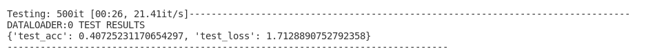
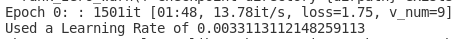

# EMLO Session 8

The objective of this class is to 'master' Pytorch Lightning and implement four features not presented in the lecture.


# Note

The base code has been copied from last week's class. However, the code has been decoupled from Kubernetes/Kubeflow, so parts of the code have been removed. The code can now be execute on its own.

# Files

* **cifar10_pre_process.py:** This file downloads and preprocesses the CIFAR10 dataset. It creates separates train/val/test directories in which the processes files are placed. It has to be called directly via `python3 cifar10_pre_process.py`
* **cifar10_datamodule.py:** This file contains the DataModule - a much more organized way of parsing data.
* **cifar10_train.py:** This contins the model and the training loop written in Pytorch Lightning.
* **cifar10_pytorch.py:** This file is our main executable. Arguments can be passed to this file. 

# Arguments

## Trainer Test

This method can be used to test our trained model on our test dataset. Note that the Dataset/DataModule can be different from the one used during `.fit()`.

```python
trainer.test(model, datamodule=data_module)
```
It will display the values that have been logged in the `test_step()` method.


## Learning Rate Finder 

Define `self.lr` or `self.learning_rate` in the ``__init__` method.

```
self.lr=self.args.get("lr", 0.001)
```

```python
lr_finder = trainer.tuner.lr_find(model, datamodule=data_module, early_stop_threshold=None, min_lr=0.0001)
lr = lr_finder.suggestion()
print(f"Found lr: {lr}")
model.lr = lr
```


To verify that this is indeed the learning rate used during training, we print the learning rate at the end of training (i.e. in the `training_epoch_end` method)

```python
print(f'Used a Learning Rate of {self.lr}')
```



## Gradient Clipping

In Pytorch, gradient clipping was done via the following line inside our training loop:

```
torch.nn.utils.clip_grad_norm_(model.parameters(), 1)
```

But in Pytorch Lightning, we can specify this as an argument to our trainer.

```
trainer = Trainer(max_epochs=1, gradient_clip_val=1, ...
```

## CSV Logging

Logging in a CSV file can be less resource intensive. A typical drawback in Tensorboard logger is that it logs over steps, and not epochs. We can log into CSV files, which can be read later. A CSV logger can be specified as

```python
from pytorch_lightning.loggers import CSVLogger
csvlogger = CSVLogger('csv_logs', name='EMLO8')
trainer = pl.Trainer(max_epochs=10, logger=csvlogger, ...
```

For a complete working example, please see my previous assignments.

